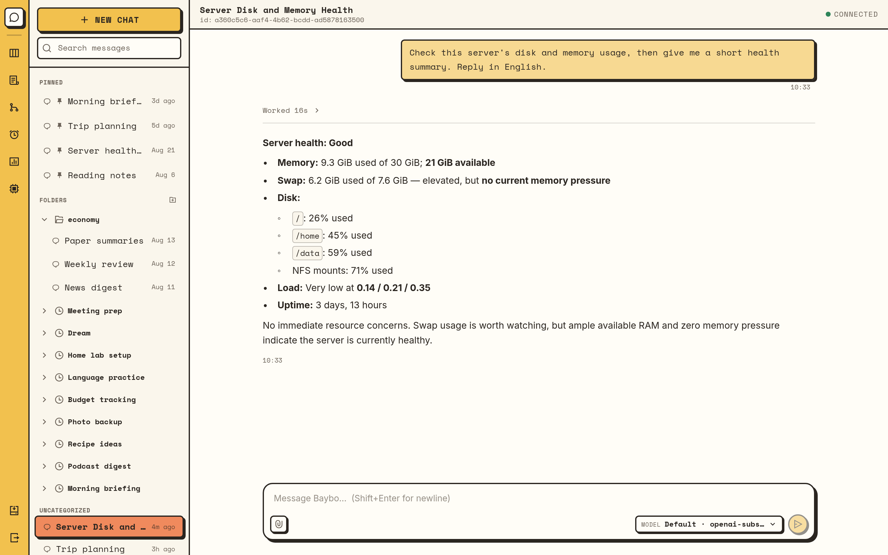
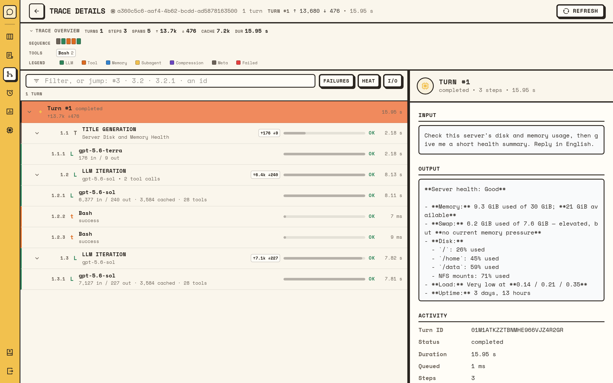
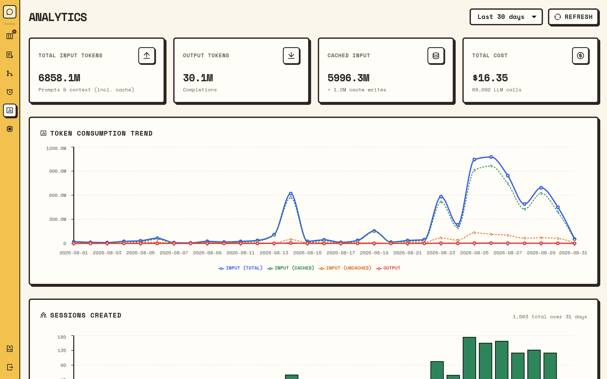
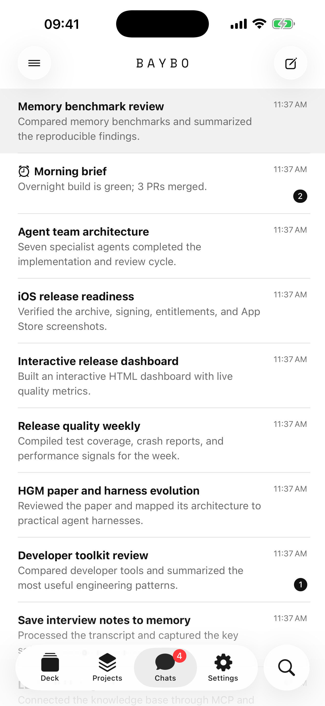
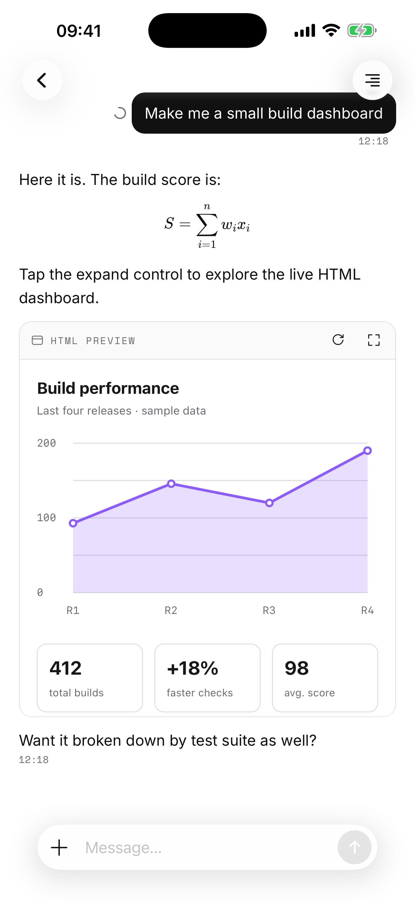
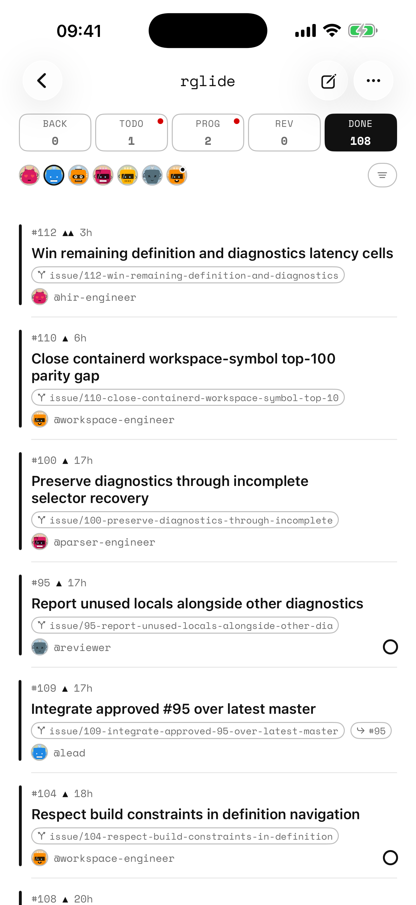
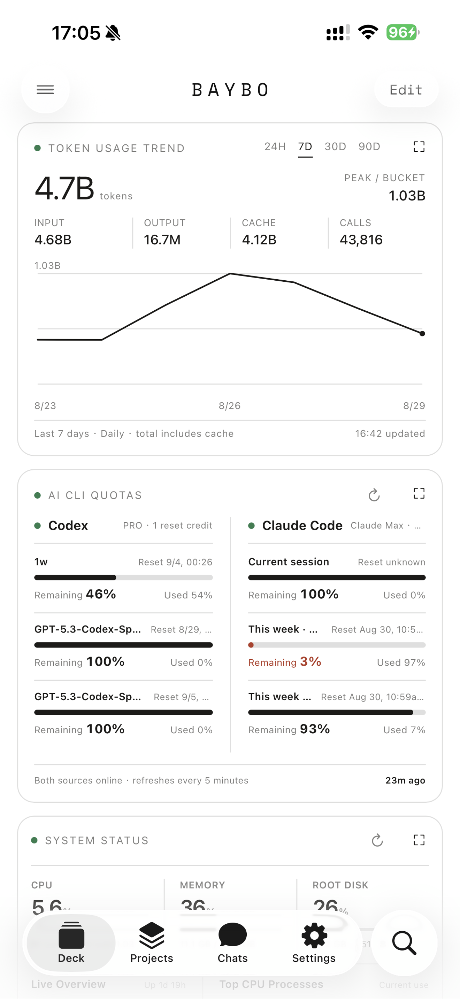

<p align="center">
  
</p>

<h1 align="center">Baybo</h1>

<p align="center">
  English | <a href="README.zh-CN.md">简体中文</a>
</p>

<p align="center">
  A self-hosted, always-on AI assistant framework —<br>
  multi-channel access, tool invocation, skill extensions, with full context management,
  cost tracking, and error recovery.
</p>

---

Baybo runs as a single daemon (the **gateway**) on your own machine. Talk to it through
the embedded web dashboard, a terminal UI, Telegram, WeChat, or the paired iOS app —
all views onto the same sessions, stored locally in SQLite. The agent behind it has a
full tool set (files, shell, web, MCP), spawns typed subagents, runs cron
jobs, keeps per-agent long-term memory, and records every turn as a browsable trace
with per-call cost accounting.

## Features

- **Multi-channel** — web dashboard, terminal UI, one-shot CLI, Telegram and WeChat
  bots, and an end-to-end-encrypted iOS companion app. New channels plug in through a
  TypeScript sidecar SDK.
- **19 LLM providers** — Anthropic, OpenAI (API key, or your ChatGPT/Codex
  subscription over OAuth — the Codex Responses API, no API key), Gemini,
  DeepSeek, xAI, Mistral, Groq, Ollama, llamafile, and more; per-session model
  switching, live config reload.
- **Tools & MCP** — built-in `Read`/`Write`/`Edit`/`Bash`/`Grep`/`WebFetch`/`WebSearch`
  and friends, plus any MCP server via `baybo mcp add`.
- **Extensible agents** — declarative skills with trust tiers and an LLM risk assessor,
  typed subagent profiles, delegation to external `claude` / `codex` CLIs, kanban boards
  where a team of agents works issues in git worktrees.
- **Always-on** — cron jobs created conversationally, background jobs, built-in
  file-based memory with a periodic "dream" consolidation pass, optional pluggable
  memory backends (mem0, OpenViking).
- **Secure by default** — encrypted secret vault, OS sandbox for shell commands,
  approval gates, per-user pairing for inbound messages, secret leak detection.
- **Observable** — every unit of work is a Turn with a full trace tree and token/cost
  accounting, browsable in the web dashboard.

## iOS app

A native iOS client ([`app/ios`](app/ios)): scan a QR to pair with your gateway, then
chat over an end-to-end-encrypted transport — push-notification previews are encrypted
too, so the relay and Apple only ever see ciphertext.

```bash
baybo device pair    # prints a QR; scan it in the app, confirm the code on both sides
```

Pairing — and chat, whenever the phone can't reach the gateway directly — runs through
a **blind relay**, so a gateway behind NAT needs no public address. The default is the
hosted relay `wss://proxy.baybo.space` (push: `https://push.baybo.space`) with the
built-in trial key; **it is provided for trial use only, with no stability guarantee**.

For production use, self-host the relay
([`remote-host/DEPLOY.md`](remote-host/DEPLOY.md)) and pass your own
`--proxy-url` / `--push-url` / `--remote-api-key`. Build and install the app from
[`app/ios`](app/ios); details in
[`docs/modules/mobile/companion.md`](docs/modules/mobile/companion.md).

## Requirements

Baybo targets **Linux and macOS** only.

| Binary | Needed for |
|---|---|
| Rust toolchain (rustup) | building — version pinned by `rust-toolchain.toml` |
| `pnpm` | building — web dashboard and sidecars are compiled into the binary |
| `git` | runtime (workspace identity repos) |
| `rg` (ripgrep) | the agent's `Grep`/`Glob` tools |
| `bun` | Telegram/WeChat sidecars and deck cards (build + runtime) |
| `node` | browser tool sidecar only |
| `bwrap` / `sandbox-exec` / `docker` | OS sandbox for shell commands (recommended) |

## Build

```bash
git clone https://github.com/booiris/baybo && cd baybo
pnpm install
cargo build --release       # produces target/release/baybo
```

Without bun the sidecar bundles are embedded empty (Telegram/WeChat won't start) —
`BAYBO_REQUIRE_SIDECARS=1` turns that into a hard build error. Without pnpm the
dashboard build fails hard; `BAYBO_SKIP_WEBUI=1` skips it. Put the binary on your
`PATH`: `cargo install --path crates/baybo`.

## Quick start

```bash
baybo setup            # first-run wizard: workspace, encryption key, LLM provider
baybo gateway start    # start the daemon (prints dashboard URL + admin token)
```

Then talk to it from a second terminal:

```bash
baybo tui                                   # terminal chat
baybo prompt "introduce yourself"           # one-shot answer to stdout
git diff | baybo prompt "review this"       # piped stdin becomes context
```

or open the **web dashboard** at `http://127.0.0.1:8888` and paste the token
(`baybo gateway token show` recovers it). To run as a service:

```bash
baybo gateway install    # systemd user unit (Linux) / launchd agent (macOS)
baybo gateway enable     # mint the admin token, enable autostart, start now
```

> Debug builds use `./.baybo` as the workspace root; release builds use `~/.baybo`.

## Everyday commands

```text
baybo status [--live]     health/inventory snapshot
baybo doctor              readiness checks: config, storage, LLM probe
baybo llm …               LLM provider entries (status / probe / add / edit / default)
baybo channel …           chat bots (list / add / remove)
baybo mcp …               MCP servers (add / list / get / remove)
baybo secret …            vault secrets the agent can inject into Bash
baybo pair …              approve/revoke inbound channel users
baybo gateway …           daemon lifecycle + admin token
baybo skills …            inspect skills
baybo memory …            pluggable memory backend
baybo external-agent …    claude / codex delegation
baybo completion <shell>  shell completions
```

More operator families (`config`, `session`, `turn`, `cron`, `log`, `cost`) are hidden
from `--help` unless `BAYBO_HELP_AGENT=1` is set. Most read-only commands also work
inside any chat as slash commands (`/status`, `/config show`, …); mutating ones need
`--yes`. Logs: `RUST_LOG=baybo=debug`, files in `<workspace>/logs/`,
`baybo log main -f` to tail.

## Configuration

One JSON file: `~/.baybo/config/baybo.json` (override with `--config` or
`BAYBO_CONFIG_PATH`); [`baybo.example.json`](baybo.example.json) is a starting point.

| Section | Controls |
|---|---|
| `llm`, `default-llm` | named provider entries and the default — note the **dash** in `default-llm` |
| `agent` | iteration cap, context budget/compression, subagent depth, model tiers |
| `channels` | terminal channel switch (bots register via `baybo channel add`, not config) |
| `permission` | Bash approval policy: `auto` (default), `manual`, `free` |
| `gateway` | bind address/port (default `127.0.0.1:8888`) |
| `cost` | spending limits and rate limit |
| `memory` | built-in file memory + dream schedule; pluggable backend |
| `web_search`, `browser`, `proxy`, `external_agents`, `security`, `skills`, `workspace` | see [`docs/modules/config.md`](docs/modules/config.md) |

API keys never live in the file — they resolve from `api_key_env`, then the encrypted
vault (where `baybo llm add` puts them), then the provider's conventional env var.
Edit via `baybo config set <path> <value>` + restart; `llm`, `cost` limits,
`web_search`, and `permission` hot-reload via SIGHUP
([`docs/config-hot-reload.md`](docs/config-hot-reload.md)).

## Chat channels

Telegram and WeChat ship in-tree:

```bash
baybo channel add        # pick a channel, paste the bot token (QR scan for WeChat)
```

A running gateway picks the bot up within seconds. Unknown senders must be paired
before they can talk:

```bash
baybo pair approve <CODE>
```

To build your own channel, implement the `Channel` interface from
[`sidecars/sdk/channel-ts`](sidecars/sdk/channel-ts) and drop the package under
`sidecars/channel/<name>/` — see [`docs/sidecars.md`](docs/sidecars.md).

## Docker deployment

```bash
cd deploy/docker
cp .env.example .env     # set BAYBO_LLM_API_KEY
docker compose up --detach --build
docker compose exec baybo baybo gateway token show   # dashboard login token
```

Open `http://localhost:8888`. Session data lives in the `baybo-data` volume — never
`docker compose down --volumes`. Details: [`deploy/docker/README.md`](deploy/docker/README.md).

For phones behind NAT, [`remote-host/`](remote-host) is a separately deployed blind
relay + APNs push sender ([`remote-host/DEPLOY.md`](remote-host/DEPLOY.md)).

## Extending Baybo

- **Skills** — one directory per skill under `personas/<agent>/skills/<name>/SKILL.md`;
  invoked as `/<name>` or auto-selected by the model.
  [`docs/modules/skills.md`](docs/modules/skills.md)
- **Subagents** — one Markdown profile per type in `<workspace>/agents/<name>.md`;
  spawned via `spawn_subagent`. [`docs/modules/subagent.md`](docs/modules/subagent.md)
- **External agents** — subagents can run on a host-installed Claude Code or Codex CLI,
  outside Baybo's sandbox. [`docs/external-agents.md`](docs/external-agents.md)
- **MCP servers** — `baybo mcp add` writes `<workspace>/config/.mcp.json`; tools
  surface as `<server>/<tool>`. [`docs/modules/tools.md`](docs/modules/tools.md)
- **Cron jobs** — created conversationally; each fire is a real session with a trace.
  [`docs/modules/cron.md`](docs/modules/cron.md)
- **Memory** — per-agent markdown memory with a dream job, on by default; mem0 or
  OpenViking via `baybo memory setup`.
  [`docs/modules/memory-builtin.md`](docs/modules/memory-builtin.md)
- **Kanban projects** — agent teams working issues in per-issue git worktrees.
  [`docs/modules/project.md`](docs/modules/project.md)
- **Deck cards** — agent-authored live cards on iOS.
  [`docs/modules/deck.md`](docs/modules/deck.md)

## Screenshots

**Web dashboard** — chat, the trace viewer, and analytics:

<p align="center">
  
</p>
<p align="center">
  
  
</p>

**iOS app** — conversations, rich replies with live HTML, kanban boards, and the deck:

<p align="center">
  
  
  
  
</p>

## Development

```bash
cargo fmt
cargo clippy --all --benches --tests --examples --all-features   # zero warnings
cargo nextest run --workspace
pnpm --filter @baybo/channel-sdk test
```

Start with [`docs/architecture.md`](docs/architecture.md), then the per-module design
docs in [`docs/modules/README.md`](docs/modules/README.md). Contributor rules:
[`CLAUDE.md`](CLAUDE.md) · direction: [`docs/roadmap.md`](docs/roadmap.md).

## License

[MIT](LICENSE)
