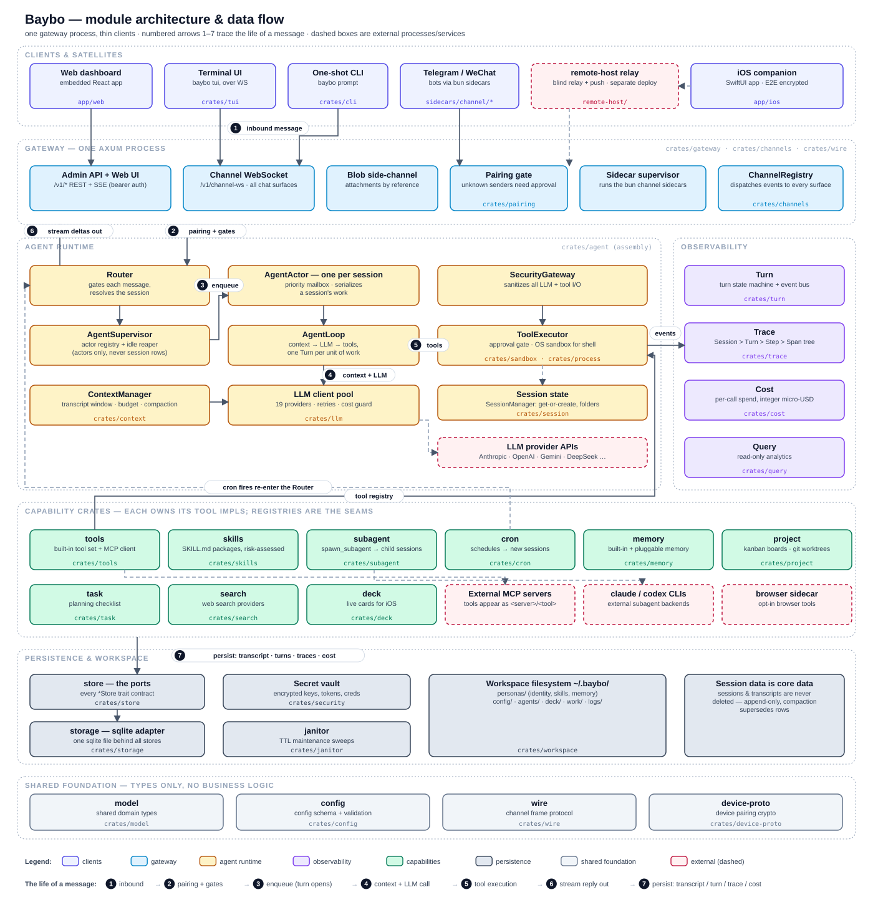

# Baybo Architecture

A top-level map of how Baybo is put together: the process topology, the crate layers,
the life of a message, the actor model, persistence, observability, and the security
model. Per-module detail lives in the design docs indexed at
[`modules/README.md`](modules/README.md) — each crate's doc is the source of truth for
that module; this document is the connective tissue between them.

## Bird's-eye view

Baybo is **one long-running process** — the gateway — plus thin clients. The gateway
embeds everything: the agent runtime, the SQLite store, the web dashboard bundle, and
the channel sidecar bundles.

The numbered arrows ①–⑦ in the diagram correspond one-to-one to the steps in
["The life of a message"](#the-life-of-a-message) below.

The workspace directory (default `~/.baybo`) holds all durable state outside SQLite:
`config/baybo.json`, the master encryption key (`.key/`), per-agent persona files
(`personas/<id>/` — identity, skills, memory), subagent profiles (`agents/`), logs, and
scratch space (`work/`).

One gateway can host several **agents**: each is a persona directory under
`personas/<id>/`, and a session binds to one agent profile at creation — the system
prompt, skill set, and long-term memory are all per-agent
([`modules/agent-profiles.md`](modules/agent-profiles.md)). Mind the naming:
`personas/` holds the top-level agents, while the adjacent `agents/` directory holds
**subagent** profiles — typed workers an agent fans out to mid-turn.

## Layer model

The workspace is ~40 crates; the domain crates are arranged in five layers, with a few
helpers (`wire`, `device-proto`, the test/bench harnesses) outside the layer model
(full crate index and dependency graph:
[`modules/README.md`](modules/README.md)). The rule throughout: high cohesion,
low coupling — crates interact via traits defined in the crate that owns the domain,
and registries (channels, tools, skills) are the plug-in seams.

**Foundational Types** — `model` (shared content and domain types: `ChatMessage`,
`ContentBlock`, `Session`, `TriggerSource`, `Lineage`, cron and cost types; no business
traits), `store` (the persistence **ports** crate: every `*Store` trait plus the
row/DTO types they exchange), `config` (`BayboConfig` and validation).

**Ingress and Security Boundary** — `channels` (channel registry and message types:
`IncomingMessage`, `OutgoingMessage`, `AgentEvent`), `security` (encryption primitives,
leak detection).

**Capability and Governance** — `process` (sole owner of raw subprocess spawning),
`llm` (provider registry), `tools` (the `Tool` trait, registry, and MCP client),
`sandbox`, `skills` + `skills-assessor`, `subagent`, `task`, `search` (web search),
`deck`, `project`, `cron`, `workspace`, `context` (the `ContextManager`: transcript ownership,
token budget, compaction), `session` (the `SessionManager` facade). Domain crates own
their own `Tool` impls and depend on `baybo-tools` only for the trait — never the
reverse.

**Runtime and Observability** — `turn` (the Turn state machine and `TurnLifecycle`),
`trace` (`Step`/`Span` types and the `SpanRecorder`), `cost` (`CostManager`, integer
micro-USD), `memory` (the pluggable backend trait; the built-in file memory is a
cross-crate feature, see [`modules/memory-builtin.md`](modules/memory-builtin.md)),
`query` (read-only analytics).

**Infrastructure and Assembly** — `storage` (the SQLite adapter implementing every
`*Store` trait from `store`), `agent` (the assembly layer: `Router`, `AgentActor`,
`AgentLoop`, `ToolExecutor`, `SecurityGateway`), `gateway`, `cli`, `tui`, `setup`,
`bootstrap` (`crates/baybo` — the binary), `janitor`, `pairing`.

## The life of a message

1. **Inbound.** A channel adapter turns whatever arrived (WS frame, sidecar message,
   REST call) into a `baybo_channels::IncomingMessage`.

2. **Pairing + gates.** Sidecar-routed messages first pass the per-user **pairing
   gate** (`baybo-pairing`): unknown senders get a 6-char code and their message is
   dropped until `baybo pair approve`. Then `Router::handle_incoming`
   (`crates/agent/src/actor/router/`) applies the pre-actor gates, in order: `/stop`
   is recognized out-of-band first (a busy actor can't read its own mailbox, so
   cancellation lives here); then per-user rate limiting; then the spending-limit
   check (so an over-budget user never spins up an actor); then session
   lookup/creation. A pre-actor rejection always emits a terminal event — clients
   never hang silently.

3. **Enqueue — a turn opens.** One `AgentActor` per session, registered in the
   `AgentSupervisor`; if it isn't resident, it is spawned and hydrated from durable
   state (the transcript window rebuilt through `ContextManager::restore_from_store`,
   repairing any crash-torn tool-call pairing on the way). The message queues in the
   actor's bounded priority mailbox (user/cron/spawn triggers above background
   results, `ActorStop` lowest), and every externally-triggered unit of work — a chat
   message, a cron fire, a `/compact`, a cron-result delivery — opens a **Turn**
   (`baybo-turn`): `Pending → InProgress → Completed | Failed | Cancelled`, with a
   recoverable `Stuck ⇄ InProgress` detour.

4. **Context + LLM call.** Per iteration, `AgentLoop`: reconciles the system prompt
   (assembled by `baybo-context` from the agent's persona files) and the skill
   listing; compresses the context if over budget (the transcript is never
   rewritten — compaction *supersedes* rows); builds the request; calls the LLM
   through the cost-guarded client pool (with bounded retry/backoff); sanitizes the
   response through `SecurityGateway`; then dispatches any tool calls.

5. **Tool execution.** `ToolExecutor` validates capability declarations, runs the
   approval gate (per-channel, with `ApproveAlways` persisted onto the session),
   reveals secret placeholders only at execution time, and gives
   `ExecCommand`-declaring tools a fresh OS sandbox (`bwrap` / `sandbox-exec` /
   Docker, workspace-scoped). Output is capped, scanned for injection, wrapped in a
   `<tool_output>` envelope, and appended.

6. **Stream reply out.** Replies and streaming deltas flow back through the
   `ChannelRegistry` to every attached surface — web, TUI, sidecars, and the device
   leg alike.

7. **Persist.** Along the way each hop persists: transcript rows (append-only,
   ordinal-keyed), Turn transitions (whose event bus drives read-state, push
   notifications, and the web UI), trace spans, and per-call cost records.

Mid-turn user messages are **interjections**: they drain at the next tool boundary and
join the running turn rather than preempting it; `/stop` is the only hard interrupt.

## Actor model and concurrency

- **One actor per session** serializes all writes within a session while sessions run
  concurrently. This is a load-bearing invariant: the append-only transcript's
  ordinal allocation relies on it.
- All I/O is async on tokio; shared state is `Arc` + `parking_lot` locks.
- An **idle reaper** shuts down actors (never sessions) after ~30 minutes of
  inactivity; the next message re-hydrates the actor losslessly from the store. Session
  rows and transcripts are user-facing core data and are **never deleted** by the
  runtime — `hidden` is the user-facing removal affordance.
- Boot-time recovery closes half-open trace rows and cancels non-terminal turns as
  crashed; actor panics are contained per session by the supervisor.
- Long-running work escapes the turn as a **background job**: a Bash command or
  subagent that outlives its timeout detaches, keeps running under the job pool, and
  its completion is delivered back through the priority mailbox as a new autonomous
  turn on the same session (`JobList`/`JobStop` to inspect and cancel — see
  "Background jobs" in [`modules/agent.md`](modules/agent.md)).

## Persistence

`baybo-store` defines the port traits (`SessionStore`, `TurnStore`, `TraceStore`,
`CostStore`, `CronStore`, …) and their row types; `baybo-storage` is the single SQLite
adapter behind all of them (one pool, single-writer queue, `0600` database file).
Domain logic never lives in the storage layer, and — per the crate-boundary rules in
[`../CLAUDE.md`](../CLAUDE.md) — a domain's store handle does not leak outside the
crate that owns the domain: consumers get narrow, task-shaped methods instead.

Binary payloads (attachments, avatars) are stored as **blobs and passed by
reference** (`BlobRef`) — raw bytes never ride the transcript, the trace, or the
channel WebSocket (sidecars use a dedicated HTTP blob side-channel).

## Observability

The tracing hierarchy is `Session > Turn > Step > Span (+ SpanEvent)` — one session is
exactly one trace tree. Subagents get their **own** sessions, linked to the parent via
`Lineage`, so fan-out is browsable as a tree of sessions rather than a tangle inside
one. Every LLM call records token usage and cost (integer micro-USD, never floats)
keyed to its span; the web dashboard's trace viewer, analytics page, and `baybo cost`
all read the same records through `baybo-query`.

Logs, turns, and traces never record sensitive plaintext — only vault placeholders and
sanitized summaries (see Security below).

## Security model

- **Secret vault** — AES-256-GCM over SQLite, master key at `.key/encryption.key`.
  LLM keys, bot tokens, MCP credentials, and user secrets all live here; `baybo.json`
  holds only references. Secrets enter a Bash command via explicit `secret_env`
  injection, and outputs are scrubbed by exact match.
- **Sanitization** — `SecurityGateway` (in `baybo-agent`) intercepts LLM responses and
  tool output: leak detection, injection detection, placeholder substitution. Plaintext
  leaves the system only at four audited reveal points (tool arguments at execution,
  tool-side LLM calls, child-process `secret_env` injection, and deck's host-mediated
  `ctx.fetch`); stream deltas, outgoing messages, trace, memory, and persistence all
  carry placeholder form.
- **Sandbox + approvals** — the Bash tool runs under an OS sandbox where a backend is
  available, governed by the `permission` mode (`auto` = AST pre-filter + LLM judge,
  `manual` = human approves everything, `free`). Other tools carry their own gates;
  writes to an agent's identity and memory files under `personas/`
  (`{SOUL,IDENTITY,USER}.md` and `memory/**`) are audited — git-committed — rather
  than approved.
- **Pairing** — inbound sidecar users are default-deny until operator approval, scoped
  per `(channel, bot, user)`; the iOS device leg uses Noise with mutual confirmation
  and a blind relay that only ever sees ciphertext.
- **Admin surface** — the REST/SSE API, web dashboard, and web-chat WebSocket are
  bearer-token authenticated (the token is minted on first `baybo gateway start` or
  `enable`, recoverable via `baybo gateway token show`); the gateway binds
  `127.0.0.1:8888` by default, so exposing it beyond localhost is an explicit config
  decision ([`modules/gateway.md`](modules/gateway.md)).
- **Governance** — skills carry source, version, and trust level (with a content hash
  keying cached risk verdicts); tools carry trust level and capability declarations;
  an LLM risk assessor judges skill content before injection.
  The deliberate exceptions are documented where they live: deck card services run
  unsandboxed on the host (trusted-author model), and external `claude`/`codex`
  backends run with their own approvals bypassed — spawning one is equivalent to
  running that CLI on the host.

## Extension points

| Seam | Mechanism | Doc |
|---|---|---|
| Channels | TypeScript sidecar implementing the SDK's `Channel` interface, run under bun, discovered by directory | [`sidecars.md`](sidecars.md), [`modules/channels.md`](modules/channels.md) |
| Tools | `Tool` trait + registry; MCP servers via `<workspace>/config/.mcp.json`, hot-reconciled | [`modules/tools.md`](modules/tools.md) |
| Skills | `SKILL.md` per skill under `personas/<agent>/skills/`, trust-tiered, risk-assessed | [`modules/skills.md`](modules/skills.md) |
| Subagents | Markdown profiles in `<workspace>/agents/`, spawned via `spawn_subagent` | [`modules/subagent.md`](modules/subagent.md) |
| Agent profiles | DB-backed personas binding sessions to `personas/<id>/` (identity, skills, memory, LLM pin) | [`modules/agent-profiles.md`](modules/agent-profiles.md) |
| LLM providers | provider factory registry in `baybo-llm` | [`modules/llm.md`](modules/llm.md) |
| Memory | one pluggable `Memory` trait (mem0 / OpenViking backends) alongside the built-in file memory | [`modules/memory.md`](modules/memory.md), [`modules/memory-builtin.md`](modules/memory-builtin.md) |
| Scheduled work | cron jobs via conversational `Cron*` tools; every fire is a session + turn + trace | [`modules/cron.md`](modules/cron.md) |
| Live cards | agent-authored deck bundles (bun service + sandboxed iOS card) | [`modules/deck.md`](modules/deck.md) |
| Agent teams | kanban boards with per-issue git worktrees and a run ledger | [`modules/project.md`](modules/project.md) |

## Deployment topology

The common shape is everything-in-one: `baybo gateway start` on a workstation or small
server, clients connecting locally (dashboard, TUI) — optionally installed as a
systemd/launchd service, or as the Docker Compose stack in
[`../deploy/docker`](../deploy/docker). Two optional satellites extend the reach:

- **`remote-host/`** — a separate, `baybo`-independent workspace: a blind WebSocket
  relay (so NAT'd gateways and phones can meet) plus an optional APNs push sender. It
  forwards ciphertext only.
- **`app/ios/`** — the companion app, pairing 1:1 to a gateway either directly or
  through the relay.

## Where to go next

- Module index and dependency graph: [`modules/README.md`](modules/README.md)
- Where the project is headed: [`roadmap.md`](roadmap.md)
- Message/turn/trace vocabulary for the chat sync protocol: [`CONTEXT.md`](CONTEXT.md)
  and [`sync-protocol.md`](sync-protocol.md)
- Web dashboard internals: [`webui.md`](webui.md), [`web-chat.md`](web-chat.md)
- Testing conventions: [`testing.md`](testing.md)
- External binaries Baybo shells out to: [`external-commands.md`](external-commands.md)
